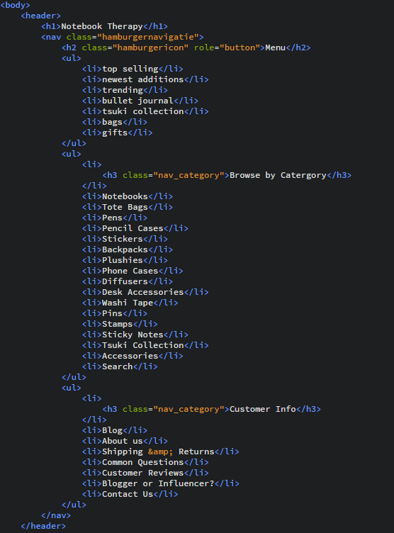
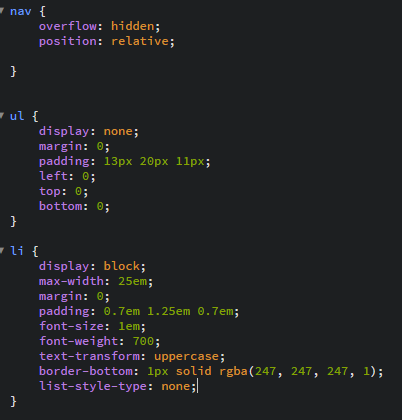
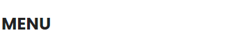
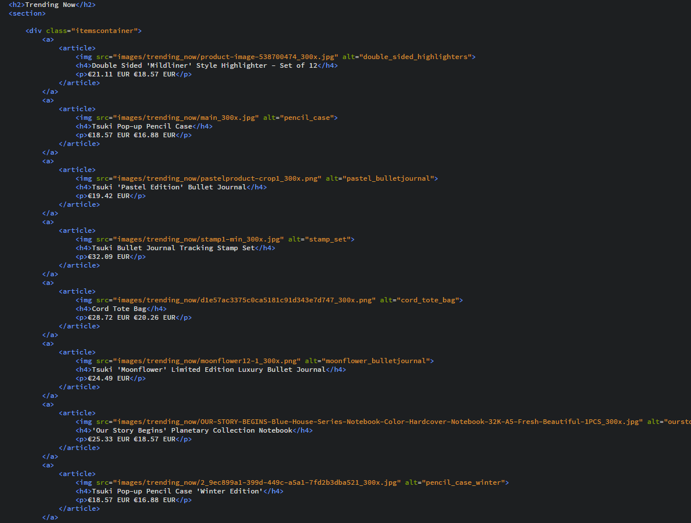
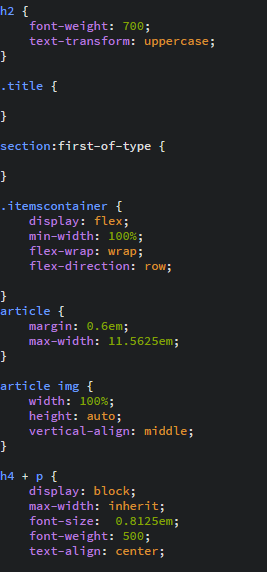
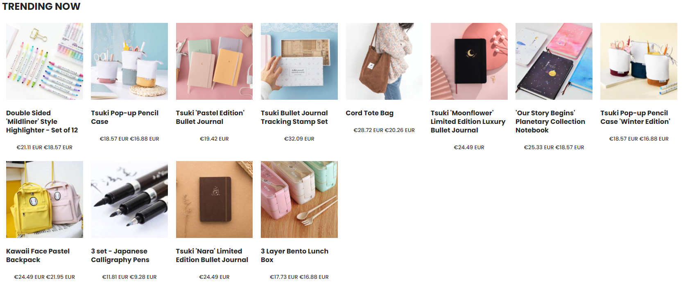

# Procesverslag
**Auteur:** -Lisanne Sabelis-

Markdown cheat cheet: [Hulp bij het schrijven van Markdown](https://github.com/adam-p/markdown-here/wiki/Markdown-Cheatsheet). Nb. de standaardstructuur en de spartaanse opmaak zijn helemaal prima. Het gaat om de inhoud van je procesverslag. Besteedt de tijd voor pracht en praal aan je website.

## Bronnenlijst
1. NotebookTherapy. (2020, 13 november). NotebookTherapy - Japanese + Korean Stationery Shipped Free Worldwide. https://notebooktherapy.com/
2. -bron 2-
3. -...-

## Eindgesprek (week 7/8)

-dit ging goed & dit was lastig-

**Screenshot(s):**

-screenshot(s) van je eindresultaat-

## Voortgang 3 (week 6)

-same as voortgang 1-

## Voortgang 2 (week 5)

-same as voortgang 1-

## Voortgang 1 (week 3)

### Stand van zaken

dit ging goed & dit was lastig:
Wat goed ging was het linken naar een font in de html.
Verder had ik moeite met een hamburger menu maken voor de mobiele site en had ik moeite met flexbox.
Het gaat daar nu wel wat beter mee.

**Screenshot(s):**

-screenshot(s) van hoe ver je bent met korte uitleg-
Dit is wat ik op dit moment heb voor de navigatie.

Dit is wat ik op dit moment heb voor de section trending.

### Agenda voor meeting

-samen met je groepje opstellen-

| Nino           | Quincy             | Sam          | Lisanne          |
| ---            | ---                | ---          | ---              |
| dit bespreken  | en dit             | en ik dit    |                  |
| an dat ook nog | dit als er tijd is | nog een punt |                  |

### Verslag van meeting

-na afloop snel uitkomsten vastleggen-

## Breakdownschets (week 1)

-uitwerken voor de 1e werkgroep - eind van de eerste week-
Breakoutschets Homepage:

## Intake (week 1)
-uitwerken voor de kick-off werkgroep - begin van de eerste week-

**Je startniveau:** Blauw

**Je focus:** Responsive

**Je opdracht:** https://notebooktherapy.com/

**Screenshot(s) van de eerste pagina (small screen):**

**Screenshot(s) van de tweede pagina (small screen):**

